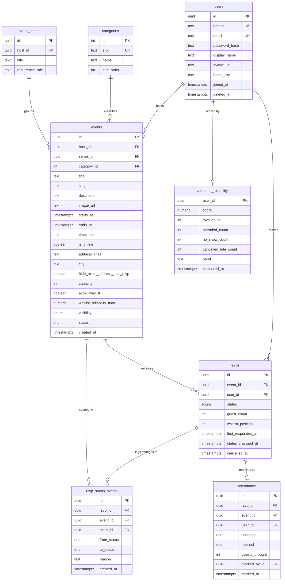
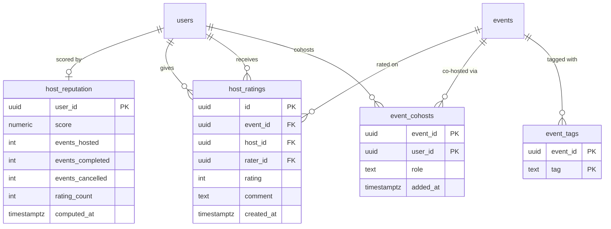
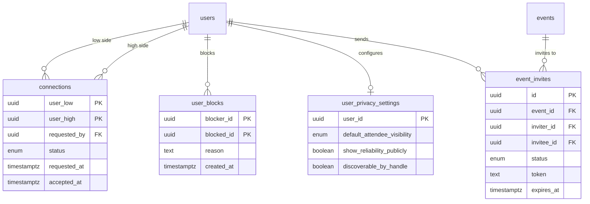
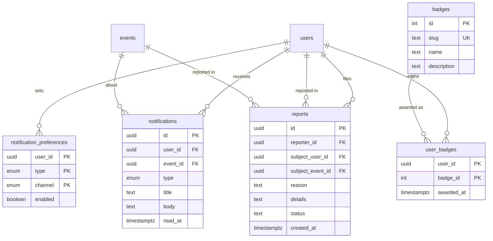

# Database Diagram — Gather

21 tables, 38 foreign keys, 16 CHECK constraints, 58 indexes, 1 view.

The diagrams below are [Mermaid](https://mermaid.js.org/), which GitHub renders
natively — open this file on GitHub and you'll see the shapes, not the source.

Column lists are abbreviated to the ones that carry meaning. `events` alone has
37 columns; reproducing all of them here would obscure the relationships, which
is what a diagram is for. Every column, type, constraint, and index is in
[`apps/backend/database/schema.sql`](../apps/backend/database/schema.sql), which
is generated from the Prisma migrations rather than maintained by hand.

`PK` = primary key. `FK` = foreign key. `UK` = unique.

Six tables use a **composite primary key** made of two foreign keys —
`connections`, `user_blocks`, `event_cohosts`, `event_tags`,
`notification_preferences`, and `user_badges`. Those columns are marked `PK`
below and are foreign keys as well; Mermaid renders one key marker per column,
so the FK role is noted here rather than in the diagram.

---

## Core: events, RSVPs, and the attendance ledger

This is the part that matters. Everything else is supporting cast.



### Why it's shaped this way

**`rsvps` holds current state; `rsvp_status_events` holds history.** One row per
person per event, unique on `(event_id, user_id)`, so "am I going?" is a single
indexed lookup. Every transition is *also* appended to the ledger with a
timestamp and an actor. Without the ledger there is no way to tell a courteous
two-week cancellation from a no-show, and that distinction is the product.

**`attendance` is separate from `rsvps` on purpose.** Intent and outcome are
different facts. Collapsing them into one status column would mean overwriting
what someone said they'd do with what they actually did, destroying the very
comparison the score depends on.

**`attendee_reliability` is a cache, not a source of truth.** Every column is
derivable from `rsvp_status_events` + `attendance`. Drop the table and it can be
rebuilt exactly. It exists so browse doesn't have to aggregate a ledger on every
request. The same pattern applies to `host_reputation`.

---

## Hosts, ratings, and reputation

Accountability runs both directions — attendees are scored, and so are hosts.



`event_cohosts` and `event_tags` use composite primary keys rather than a
surrogate `id`. The pair *is* the identity — a user is a cohost of an event once
or not at all — so a separate key would add a column and permit duplicates.

---

## People: connections, blocks, privacy



**`connections` stores a friendship once, not twice.** The two user ids are
ordered before insert — smaller UUID into `user_low`, larger into `user_high` —
and the composite PK is `(user_low, user_high)`. A CHECK constraint enforces
`user_low < user_high`. This makes a duplicate friendship structurally
impossible rather than something application code has to remember to prevent.
`requested_by` records who initiated, which the ordering would otherwise lose.

`user_blocks` deliberately does *not* order its pair: blocking is one-directional
and asymmetric, so `(A blocks B)` and `(B blocks A)` are genuinely different rows.

---

## Notifications, badges, moderation



`reports` has two nullable subject FKs and a CHECK constraint requiring exactly
one to be set — a report targets a user *or* an event, never both and never
neither.

---

## The one view

```sql
CREATE OR REPLACE VIEW connection_edges AS
    SELECT user_low  AS user_id, user_high AS peer_id, accepted_at
      FROM connections WHERE status = 'accepted'
    UNION ALL
    SELECT user_high AS user_id, user_low  AS peer_id, accepted_at
      FROM connections WHERE status = 'accepted';
```

Storing each friendship once is right for integrity and awkward for querying —
"who are my friends?" would need to check both columns every time. The view
expands each accepted row into both directions so callers can just filter on
`user_id`. Correct storage, convenient reads, no duplicated data.

Prisma cannot express views, CHECK constraints, or partial indexes, so these
live in a hand-edited raw SQL migration alongside the generated ones.

---

## Data types and why

| Choice | Reason |
| --- | --- |
| `uuid` for user-facing ids | Sequential integers leak volume and let anyone enumerate `/events/1`, `/events/2`. `categories` and `badges` keep `serial` — they're a fixed reference list, nothing to leak. |
| `timestamptz`, never `timestamp` | An event at 6pm is 6pm *somewhere*. Without the zone, DST and travel silently corrupt the time. `events.timezone` additionally stores the IANA name for display. |
| `numeric` for scores | `float` cannot represent 0.1 exactly. Scores get compared against thresholds like `waitlist_reliability_floor`, and a comparison that's wrong in the seventh decimal is still wrong. |
| PostgreSQL `enum` for status columns | `status = 'atending'` should fail at the database, not silently store a typo that no query will ever match. |
| `text` over `varchar(n)` | Identical performance in PostgreSQL. An arbitrary length cap is a future migration for no present benefit. |

## NOT NULL and CHECK constraints

Every table has NOT NULL on the columns that make a row meaningful — an event
without `starts_at` or `title` isn't an event. Sixteen CHECK constraints back
this up with rules a type can't express. The full list, verbatim from
`schema.sql`:

```sql
CHECK (handle ~ '^[a-z0-9_]{3,30}$')                          -- users
CHECK (user_low < user_high)                                  -- connections
CHECK (status <> 'accepted' OR accepted_at IS NOT NULL)       -- connections
CHECK (blocker_id <> blocked_id)                              -- user_blocks
CHECK (capacity IS NULL OR capacity > 0)                      -- events
CHECK (ends_at IS NULL OR ends_at > starts_at)                -- events
CHECK (rsvp_closes_at IS NULL OR rsvp_closes_at <= starts_at) -- events
CHECK (NOT is_online OR online_url IS NOT NULL)               -- events
CHECK (status <> 'cancelled' OR cancelled_at IS NOT NULL)     -- events
CHECK (guest_count >= 0 AND guest_count <= 20)                -- rsvps
CHECK (status <> 'cancelled' OR cancelled_at IS NOT NULL)     -- rsvps
CHECK ((status = 'waitlisted') = (waitlist_position IS NOT NULL))  -- rsvps
CHECK (rating BETWEEN 1 AND 5)                                -- host_ratings
CHECK (num_nonnulls(subject_user_id, subject_event_id) = 1)   -- reports
CHECK (score >= 0.00 AND score <= 1.00)                       -- attendee_reliability
CHECK (score >= 0.00 AND score <= 5.00)                       -- host_reputation
```

Several are worth reading twice. `(status = 'waitlisted') = (waitlist_position
IS NOT NULL)` makes the two columns impossible to disagree — you cannot have a
waitlist position without being waitlisted, or be waitlisted without one.
`num_nonnulls(subject_user_id, subject_event_id) = 1` enforces that a report
targets exactly one thing. And `NOT is_online OR online_url IS NOT NULL` means
an online event without a link can't be saved at all.

These live in the database rather than only in Express because the database is
the last line — a bad migration, a psql session, or a second service writing to
the same tables all bypass application validation. Constraints don't.
